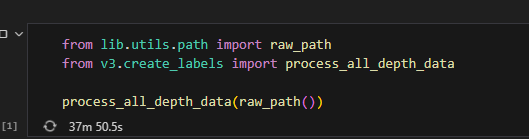

# 경사도 계산 실행 방법

data/models 폴더 안에 PIDNet_S_Cityscapes_val.pt 복사
data/raw/ 폴더안에 Depth_001 .. 등 파일 복사
```
uv pip install -e .
# 위 커맨드 실행후 run_slop_pipeline.ipynb 파일로 이동
```

위 코드를 ctrl + enter로 실행
실행이 안되면 vscode reload

# 모델 성능 결과
## convnext_tiny
### ✅ 최종 테스트 결과
- LOSS: 1.0629
- MAE (평균 각도 오차): 1.48°
- R2 Score: 0.4931
- MSE: 4.1399
- RMSE: 2.0347

### ✅ 실데이터 테스트 결과
- LOSS: 2.8773
- MAE (평균 각도 오차): 3.26°
- R2 Score: -0.0093
- MSE: 14.6174
- RMSE: 3.8233

## reset50
### ✅ 최종 테스트 결과
- LOSS: 1.4761
- MAE (평균 각도 오차): 1.92°
- R2 Score: 0.2443
- MSE: 6.1724
- RMSE: 2.4844

## efficientnet_b0
### ✅ 최종 테스트 결과
- LOSS: 2.3929
- MAE (평균 각도 오차): 2.84°
- R2 Score: -0.5662
- MSE: 12.7916
- RMSE: 3.5765